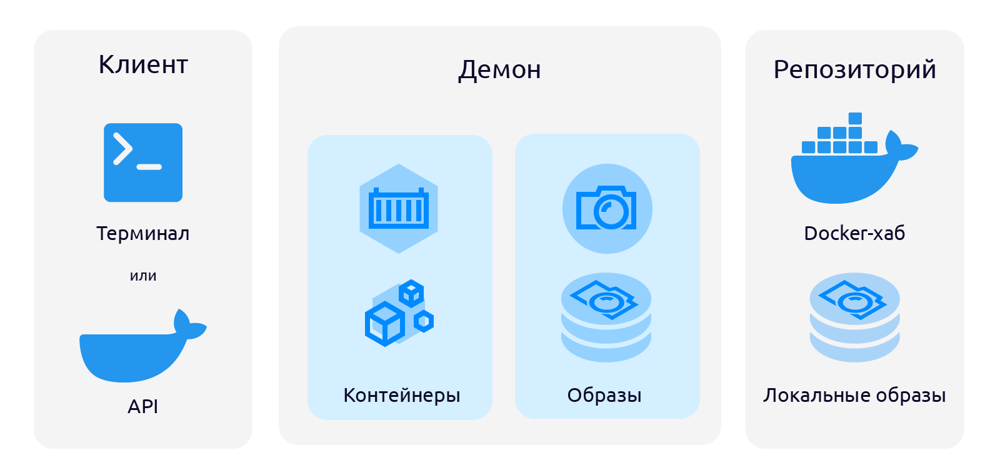
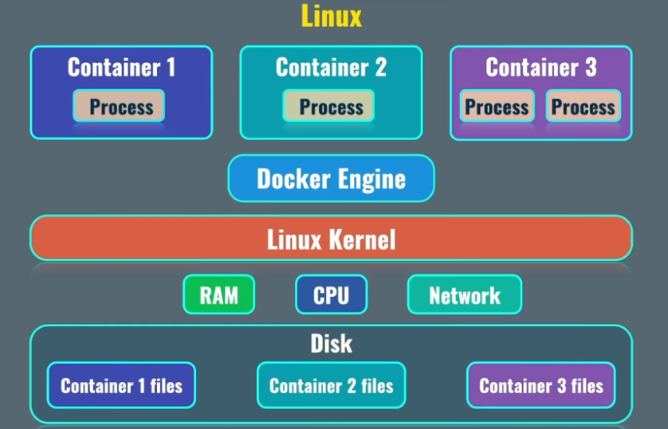
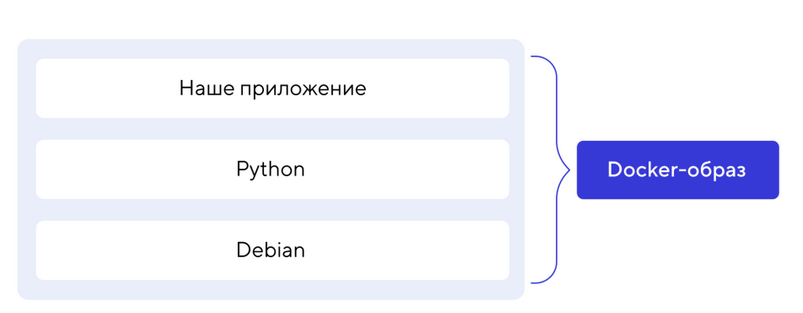

# Docker

## Определение

Docker - cервис для запуска приложений в контейнерах.

Docker использутся для запуска приложений для личных целей, в целях тестирования и в продакшене. (Для этого стоит использовать k8s).

## Преимущества

+ Приложения запускаются в изолированной среде
+ Легко мигрировать между серверами
+ Все зависимости устанавливаются внутри контейнеров
+ Легко масштабировать путём увеличения количества контейнеров
+ Легко устанавливать и настраивать

## Компоненты Docker



Компоненты экосистемы Docker можно разделить на две группы:

+ Системные компоненты: Docker host (докер-хост), Docker daemon (докер-демон), Docker client (докер-клиент) и Docker-compose (менеджер запуска кластера контейнеров);
+ Переменные компоненты: Docker image (докер-образ), Docker container (докер-контейнер), Docker registry (репозиторий), Dockerfile (докер-файл), Docker-compose.yaml (конфигурационный файл кластера контейнеров).

Первая группа:

+ Docker host (докер-хост) — это просто компьютер или виртуальный сервер, на котором установлен Docker. Кстати, Docker можно запустить и из WSL 2. Это удобно, если вы работаете под Windows и используете Visual Studio Code.
+ Docker daemon (докер-демон) — центральный системный компонент, который управляет всеми процессами докера: создание образов, запуск и остановка контейнеров, скачивание образов. Работает Docker daemon как фоновый процесс (демон) и постоянно следит за состоянием других компонентов.
+ Docker client (докер-клиент) — это утилита, предоставляющая API к докер-демону. Клиент может быть консольным (*nix-системы) или графическим (Windows).

Вторая группа:

### Контейнер

Основной компонент Docker. Каждой приложение следует запускать в отдельной контейнере. Контейнер, некая изолированная среда для исполнения приложений. Реализация контейнеров достигается использованием изолированного пространства, которое содержит все необходимые компоненты: от системных инструментов до библиотек.



Контейнеры создаются в linux. Для запуска на других ОС необходимо создавать виртуальную машину. Сделать можно с помощью Docker Desktop.

### Образ

Docker образ — это шаблон (физически — исполняемый пакет), из которого создаются Docker-контейнеры. Образ хранит в себе всё необходимое для запуска приложения, помещенного в контейнер: код, среду выполнения, библиотеки, переменные окружения и конфигурационные файлы.

Docker-образ создаётся с помощью команды docker build, которая считывает конфигурацию создаваемого образа из специального конфигурационного файла — dockerfile.

В Dockerfile записываются команды и опции создания образа, а также некоторые настройки будущего контейнера, такие как порты, переменные окружения и другие опции.

Каждая команда записанная в dockerfile создаёт свой слой. Чем больше слоёв, тем дольше будет собираться образ и дольше загружаться контейнер. Финальный Docker-образ — это объединение всех слоев в один. Благодаря такому подходу можно переиспользовать уже готовые образа для создания новых образов.



Что нужно знать о Docker-образах:

+ Образ — это только шаблон для создания контейнеров.
+ В основе любого образа лежит родительский образ, который, как правило, содержит ОС.
+ Образ состоит из слоев.
+ Каждая команда в Dockerfile создаёт новый слой.
+ Образы можно переиспользовать много раз.
+ Образы можно загружать в удаленный репозиторий.

### Репозиторий

Хранилище образов и их версий. Официальный и самый популярный - DockerHub

## Команды Docker

Получение текущей версии Docker:

```
docker version
```

Список запущенных и остановленных контейнеров (ключ ```-a``` выводит все):

```
docker ps -a
```

Список локальных образов:

```
docker images
```

Создание контейнера:

```
docker run hello-world
```

Если контейнера нет локально, то он скачается с DockerHub

Удаление контейнера по id или name:

```
docker rm id
```

Удаление образа по id:

```
docker rmi id
```

## Пример (nginx)

```
# Запуск контейнера
docker run nginx (docker run -d nginx)

# Проверка, что контейнер запущен
docker ps

# Проверяем конфигурацию контейнера и ищем ip
docker container inspect id

# Для остановнки контейнера
docker stop id

# Добавление дополнительного процесса в контейнер
docker exec -it id bash

# Для указания имени контейнера
docker run -d --name name nginx

# Для открытия порта
docker run -d -p 8080:80 nginx

# Сделаем ещё один
docker run -d -p 8081:80 nginx

# Перекидываем файл с серва внутрь контейнера
docker run -v path:/usr/share/nginx/html -p 8080:80 -d nginx

```

## Пример (mysql)

```
docker run -p 3308:3306 -d --name mysql -e MYSQL_ROOT_PASSWORD=root mysql

docker exec -it mysql bash

mysql -p

CREATE USER 'test'@'%' IDENTIFIED BY 'test';

GRANT ALL PRIVILEGES ON *.* TO 'test'@'%';

FLUSH PRIVILEGES;

```