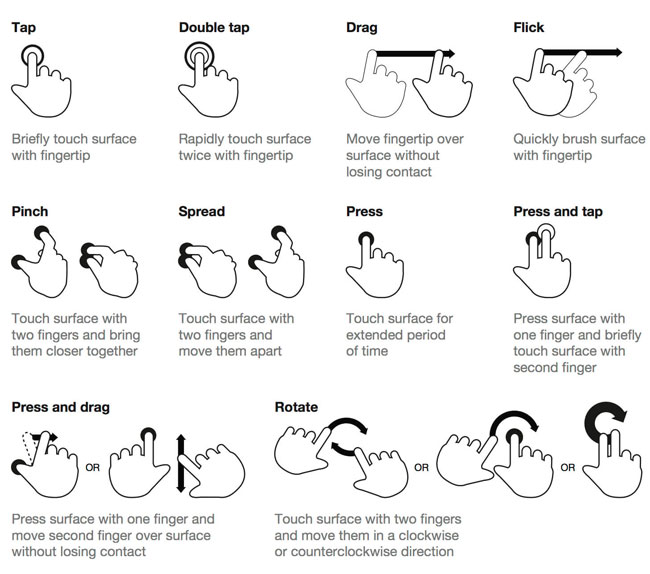

# Тестирование мобильных приложений

## Базовые понятия

Существует три основных типа мобильных приложений:

+ Мобильные web-приложения
+ Нативные приложения
+ Гибридные приложения

### Мобильные web-приложения

Мобильным web-приложением является web-сайт, который открывается в гаджете (смартфоне или планшете) с помощью мобильного браузера.

Достоинства мобильных web-приложений:

+ Простая разработка
+ Легкий доступ
+ Простое обновление
+ Мобильные web-приложения не требует установки

Недостатки мобильных web-приложений:

+ Нет поддержки автономных функций
+ Ограниченная функциональность в сравнении с гибридными и нативными приложениями (нет доступа к файловой системе и локальным ресурсам)
+ Проблемы с перераспределением: Google Play и App Store не поддерживают перераспределение мобильных web-приложений

### Нативные приложения

Нативное приложение - это приложение, разработанное специально для одной платформы (Android, iOS, BlackBerry).

Достоинства нативных приложений:

+ Нативное приложение работает в автономном режиме
+ Оно может использовать все функции своего устройства
+ Продвинутый пользовательский интерфейс
+ Push-уведомления для удобства пользователей

Недостатки нативных приложений:

+ Разработка нативных приложений обходится дороже в сравнении с мобильными web-приложениями
+ Требуется больших затрат на техническое обслуживание

### Гибридные приложения

Гибридное приложение - это сочетание нативного и мобильного веб-приложений. Его можно определить как отображение содержимого мобильного сайта в формате приложения

Достоинства гибридных приложений:

+ Более рентабельно в сравнении с нативным приложением
+ Простое распространение
+ Встроенный браузер
+ Особенности устройства

Недостатки гибридных приложений:

+ Работает не так быстро, как нативное приложение
+ Графика менее адаптирована к ОС в сравнении с нативным приложением

## Мобильные устройства

### Операционные системы

#### Android

Android – это бесплатная операционная система, разработанная для мобильных телефонов, смартфонов, коммуникаторов на базе ОС Linux. Поддерживается альянсом Open Handset Alliance (OHA). Операционная система позволяет разрабатывать Java-приложения, благодаря которым можно управлять устройством. Используется код ARM, под который можно писать приложения на С++ и др.

#### iOS

iOS — мобильная операционная система смартфонов для электронных планшетов, носимых проигрывателей и некоторых других устройств, разрабатываемая и выпускаемая американской компанией Apple.

### Важные факторы при выборе устройства для тестирования

+ Тип устройства
+ Разрешение экрана
+ Размер экрана
+ Архитектура процессора
+ Версия операционной системы

### Элементы, которые следует тестировать

#### Размер экрана и touch-интерфейс

1. Все элементы должны быть такого размера, чтобы пользователь мог однозначно попасть по ним
2. Отсутствие пустых экранов в приложении – пользователь не должен оказываться в ситуации, в которой не очевидно, что сейчас происходит и что делать
3. Следует проверять многократное быстрое нажатие на кнопку – часто при этом может случиться падение приложения. Также следует проверять мультитач – нажатие на несколько кнопок одновременно
4. Следует проверять наличие или отсутствие «нативных» жестов (pinch-to-zoom, doubletap) – если, например, поддерживается зум части приложения, то должен использоваться жест по умолчанию. А если нет необходимости выделять картинку, то по даблтапу она не должна выделяться

#### Ресурсы устройства

1. Утечки памяти - проявляется на окнах с большим количеством информации (длинные списки как пример), во время задач с длительным workflow (когда пользователь долго не выходит из приложения), при некорректно работающем кэшировании изображений
2. Обработка ситуаций нехватки памяти для функционирования ОС, когда приложение активно или работает в фоне
3. Недостаток места для установки или работы приложения
4. Отсутствие в некоторых устройствах поддерживаемых приложением функций (3G, SD-карта)
5. Установка или перенос приложения на карту SD

#### Различные разрешения экрана и версии ОС

1. Ретина и обычные экраны. На ретина-экранах элементы интерфейса и текст отображаются мельче. Картинки для ретина-экрана могут попасть в неретина-версию и тогда будут слишком большими
2. Адаптация приложения к портретной и альбомной ориентациям устройства
3. Версии ОС. Приложение не должно устанавливаться на неподдерживаемые устройства. Обязательна проверка на всех доступных из поддерживаемых девайсов
4. Поддержка необходимых медиа-файлов данной моделью и ОС, потому что отдельные разработчики могут урезать поддержку работы с некоторыми форматами
5. Соответствие используемых в приложении view их смысловому назначению и концепциям платформы. Проектные решения, которые имеют смысл для одной платформы, могут выглядеть и быть неуместными в контексте другой платформы

#### Реакция приложения на внешние прерывания

1. Входящие и исходящие SMS, MMS, звонки, оповещения других приложений
2. Выключение устройства, изъятие аккумулятора, разрядка устройства
3. Переход в режим ожидания (в том числе и с защитой паролем). Смена ориентации устройства в режиме ожидания
4. Отключение и подключение провода
5. Отключение и включение сети, Bluetooth, авиарежима, GPS
6. Потеря связи с сервером или прокси (подключение есть, но пакеты не доходят)
7. Отключение и подключение SD-карты, дополнительных устройств вроде физической клавиатуры или гарнитуры
8. Зарядка устройства, работа с физической клавиатурой

#### Платный контент внутри приложения:

1. Соответствие цены и содержимого, заявленного в приложении
2. Восстановление покупки (обновление приложения)

#### Интернационализация (проверять и в портретном, и в ландшафтном режиме!):

1. Проверка корректности перевода
2. Проверка того, что все надписи входят в соответствующие формы, кнопки и т.п
3. Проверка форматов дат, разделителей в числах, специфических особенностей локализации (вроде пробела перед знаком вопроса во французской, верхних индексов “o” и “a”, в порядковых числительных в испанской и других нетривиальных моментах)

#### Обновления:

1. Убедиться, что поддерживаются те же версии ОС, что и предыдущая версия (если новая версия приложения использует новые возможности ОС, то для старых поддерживаемых версий ОС необходимо создание урезанной версии приложения)
2. Проверка адекватного обновления (сохраняются все данные пользователя и т. п.)

#### Постоянная обратная связь с пользователем:

1. У всех нажимаемых элементов должно быть нажатое состояние (отклик на действие). В Android-приложениях у элементов может быть ещё одно состояние – focused
2. Реакция кнопок на нажатие. Скорость отклика элементов должна быть достаточно высокой. Желательно использовать для проверки этого пункта самые слабые устройства среди поддерживаемых
3. Сообщения при загрузке контента или прогресс-бар
4. Сообщения при ошибке доступа к сети, GPS
5. Наличие понятных сообщений при попытке удалить важную информацию
6. Наличие экрана или сообщения при окончании процесса или игры
7. Наличие и синхронность звуков или вибрации с уведомлениями и другими событиями на экране

#### Жесты

### Проблемы, с которыми сталкивается тестировщик мобильного приложения

+ Первый и самый важный момент заключается в том, что тестирование мобильных телефонов займёт больше времени, чем вы предполагаете, даже если вы и так допускаете, что оно займёт больше времени. (Peter-Paul Koch).

+ Мобильные устройства работают от аккумуляторов, и потому вынуждены автоматически переходить в режим ожидания спустя пару минут бездействия. Это значит, что вам придётся включать телефон перед каждым тестированием, что при одновременном тестировании нескольких телефонов, занимает приличное количество времени. Конечно, на многих устройствах можно отключить автоматическую блокировку (или хотя бы сделать время отключения довольно большим), но желательно всё же работать с самыми распространёнными среди пользователей настройками ОС.

+ Переход в режим ожидания особенно неприятен при использовании некоторых автоматизированных систем тестирования, требующих время для обработки данных (например, снятие и сравнение скриншотов). Возможно, что телефон перейдёт в режим ожидания прямо посреди теста.
Затем появляется проблема собственно набора определённого текста (например, адреса тестируемой страницы). Придётся аккуратно вводить длинные тексты в несколько устройств с разными интерфейсами.

+ Для тестирования в условиях входящих звонков, смс, вам придётся переставлять SIM-карту из одного устройства в другое, для этого зачастую надо вынимать аккумулятор. Особенно остро эта проблема стоит при тестировании особенностей и услуг мобильных операторов на нестандартных и дорогих тарифах. Кроме того, вставив SIM-карту, придётся подождать, пока телефон не включился.

+ Для тестирования GPS придётся вооружиться дополнительным инструментарием от энтузиастов и надеяться, что он работает достаточно похоже на реальные условия.

+ Для проверки слабого или отсутствующего Wi-Fi и 3G-сигнала обычно приходится либо сооружать лабораторию, либо использовать различные хитрости вроде коробочек из фольги.

+ Создание скриншотов и видео на мобильных устройствах так же зачастую нетривиальная работа, особенно если тестируется телефон, отключенный от компьютера по условиям теста или по каким-то иным причинам. Например, встроенная возможность снятия скриншота экрана на Android-устройствах появилась сравнительно недавно – с четвёртой версии. А про бесплатный способ снимать видеопоток с экрана Apple-устройства без jailbreak вообще мало кто может сказать что-то вразумительное.

+ Обычно все тесты производятся на одном устройстве, затем на другом и т. д. Это не так оптимально, как тестирование на всех устройствах одновременно, поскольку не даёт возможности просто сравнить вывод и выполнение тестов на устройствах, однако, ввиду вышеописанных трудностей, это наиболее экономичный по времени способ.

### Чеклист тестировщика

Пример чеклиста: https://software-testing.ru/images/stories/library/checklist-mobile-app-testen.pdf
