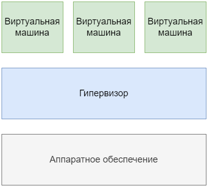
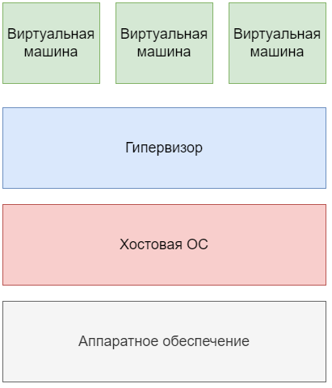

# Удалённые рабочие столы

## Определение

*Удалённый рабочий стол (Remote Desktop)* — это термин, которым обозначается режим управления, когда один компьютер получает права администратора по отношению к другому (удалённому). Связь между устройствами происходит в реальном времени посредством сети Интернет или локальной сети.

Уровень доступа в режиме удалённого администрирования определяется конкретными задачами и может быть изменен по необходимости. Например:

+ В одном случае подключение к рабочей сессии дает возможность полного контроля и взаимодействия с удаленным компьютером, при котором допускается запуск на нем приложений и манипуляции с файлами
+ В другом - удалённый доступ к рабочему столу позволяет лишь вести наблюдения за процессами, без вмешательства в работу его системы.

*Удалённое администрирование* — предустановленная функция практически в каждой известной сегодня операционной системе, одновременно с этим, существует довольно большое количество программ, которые делают данный процесс более удобным, добавляя в стандартные версии новые функции.

Существуют несколько видов удалённого администрирования:
+ Компьютер-сеть - позволяет контролировать работу локальной сети офиса или интернет-кафе
+ Терминал–компьютер - упрощает связь пользователя с системой, например, платежные терминалы банков
+ Компьютер–компьютер - чаще всего применяемый в быту, однако легко решающий и серьезные управленческие задачи
+ Сеть–сеть - отличный инструмент при необходимости взаимодействия между удаленными корпоративными сетями

## SSH

SSH (Secure SHell - защищенная оболочка) - сетевой протокол прикладного уровня, предназначеный для безопасного удаленного доступа к UNIX-системам. Данный протокол эффективен тем, что шифрует всю передаваемую информацию по сети. По умолчанию, используется 22-й порт. В основном он нужен для удаленного управления данными пользователя на сервере, запуска служебных команд, работы в консольном режиме с базами данных.

### Преимущества

Использование SSH подключения имеет ряд преимуществ:

+ Безопасная работа на удалённом сервере с использованием командной оболочки
+ Использование разных алгоритмов шифрования (симметричного, асимметричного и хеширования)
+ Возможность безопасного использования любого сетевого протокола, что позволяет передавать по защищенному каналу файлы любого размера

Главным преимуществом SSH является использование шифрования для защиты передачи данных между хостом и клиентом. Хост — это удаленный сервер к которому ты хочешь получить доступ, тогда как клиент — это компьютер с которого ты пытаешься получить доступ к хосту. 

### Недостатки

Использование SSH подключения имеет свой недостаток:

+ Протокол SSH не имеет средств защиты от действий злоумышленника, получившего root-доступ. Одной из мер предосторожности является ограничение использования режима root без острой необходимости

## RDP

RDP подключение позволяет управлять компьютером удалённо. RDP считается так называемым "прикладным протоколом", который основан на TCP. После того, как устанавливается соединение на транспортном уровне, начинается инициализация сессии этого протокола. В рамках такой сессии и происходит передача данных.

После того, как фаза инициализации будет завершена, сервер начинает передавать на компьютер (где установлен RDP-клиент) графический вывод. Затем сервер ожидает, когда к нему поступят входные данные от устройств ввода-вывода (мышь и клавиатура). Если говорить простым языком, то принцип работы RPD выглядит следующим образом: пользователь при помощи мыши и клавиатуры управляет компьютером удалённо.

Сегодня эта технология используется повсеместно. Она нужна, в первую очередь, для того, чтобы управлять компьютерными системами. Также многие наработки этой технологии используются и в робототехнике. Даже простейшая радиоуправляемая игрушка основана на схожем принципе. Человеку, в руках которого находится пульт управления, нужно использовать его, чтобы управлять движением радиоуправляемой игрушки.

Обычно для графического вывода используется копия дисплея, которая может передаваться в качестве изображения. Передача вывода происходит при помощи примитивов.

### Для чего используется RDP

Сегодня протокол RDP может применяться в нескольких случаях:

+ В целях администрирования
+ В целях получения доступа к любому серверу приложений

Этот вид соединения применяется любыми операционными системами, которые выпускала компания Microsoft. Обычно все серверные версии ОС от Microsoft могут поддерживать сразу несколько удалённых подключений, а также один локальный вход в систему.

Если же речь идёт о клиентской версии Windows, то она может поддерживать исключительно один вход. Он может быть как удалённым, так и локальным. Для получения разрешения удалённых подключений нужно включить удалённый доступ к рабочему столу. Это можно сделать прямо в свойствах рабочей станции.

Важно отметить, этот удалённый доступ возможен далеко не всегда. Удалённый доступ функционирует исключительно в версии Windows, которая предназначена для сервера. Ещё одно преимущество в данном случае заключается в том, общее число удалённых подключений не ограничено. С другой стороны, потребуется настройка сервера лицензий, а также его активация. Этот сервер можно установить на любой отдельно взятый сетевой узел, а также - на сервер терминалов.

Некоторые пользователи не понимают, что удалённый доступ к любому серверу может быть обеспечен только в случае установки все необходимых лицензий на сервер лицензий.

### Как защитить RDP

Настройка безопасности RDP - это один из ключевых вопросов. Именно правильная настройка протокола влияет на то, насколько будет безопасно передавать данные. Это особенно актуально для государственных компьютерных систем, а также различных частных коммерческих компаний, которые хотят иметь надёжную защиту от конкурентов. Сертификат RDP предусматривает использование любого доступного подхода для обеспечения безопасности. Для RDP можно использовать либо встроенную подсистему безопасности, либо же внешнюю подсистему безопасности.

В случае если пользователь выберет встроенную подсист ему, все функции по обеспечению безопасности будут реализованы средствами, которые изначально имеются в RDP. Речь идёт о процессах шифрования и аутентификации.

Если же будет выбрана внешняя подсистема безопасности, то пользователю придётся полагаться на надёжность таких внешних модулей, как CredSSP и TLS. Преимущества этого способа обеспечения безопасности заключаются в крайне надёжной аутентификации и эффективном шифровании.

Именно качественное шифрование позволяет защитить свою систему от взлома злоумышленников. Сегодня существует масса вредоносных программ и алгоритмов, которые нужны для взлома. Более того, взлом может совершить не только квалифицированный специалист, но и рядовой пользователь, который приобрёл специальное вредоносное программное обеспечение.

Многих пользователей интересует вопрос о том, какой порт использует RDP (RDP сервер). Стандартный порт - это порт под номером 3389/TCP.

# Виртуализация

## Определение

Виртуализация - предоставление набора вычислительных ресурсов или их логического объединения, абстрагированное от аппаратной реализации, и обеспечивающее при этом логическую изоляцию друг от друга вычислительных процессов, выполняемых на одном физическом ресурсе.

Основные виды виртуализации:

+ **Аппаратная виртуализация** - позволяет создавать независимые и изолированные друг от друга виртуальные компьютеры с помощью программной имитации ресурсов (процессора, памяти, сети, диска и др.) физического сервера. Физический сервер называют хостовой машиной (хостом), виртуальные компьютеры – виртуальными машинами, ВМ (иногда их также называют гостями). Программное обеспечение, которое создает виртуальные машины и управляет ими, называют гипервизором. На практике на виртуальных машинах могут использоваться разные ОС для разных целей – например, Windows Server под контроллер домена Active Directory и Debian под веб-сервер NGINX.
+ **Виртуализация рабочих столов** - позволяет отделить логический рабочий стол (набор пользовательских программ, работающий под ОС) от физической инфраструктуры (например, персональных компьютеров). Одной из наиболее распространенных форм виртуализации рабочих столов является VDI (Virtual Desktop Infrastructure) – инфраструктура виртуальных рабочих столов. Каждый пользователь VDI имеет программную имитацию ОС с необходимым набором программ на физическом сервере под управлением гипервизора и может подключаться к ней по сети. На практике VDI может использоваться для работы большого количества сотрудников на «удаленке» для того, чтобы не закупать им отдельные рабочии станции и управлять инфраструктурой централизованно.
+ **Виртуализация на уровне ОС (контейнеризация)** - позволяет запускать программное обеспечение в изолированных на уровне операционной системы пространствах. Наиболее распространенной формой виртуализации на уровне ОС являются контейнеры (например, Docker). Контейнеры более легковесны, чем виртуальные машины, так как они опираются на функционал ядра ОС и им не требуется взаимодействовать с аппаратным обеспечением. На практике контейнеры представляют из себя изолированную среду для запуска любого приложения со всеми его зависимостями и настройками.

## Виртуализация серверов

Виртуализация серверов - это процесс разделения физического сервера на несколько уникальных и изолированных виртуальных машин (серверов) с помощью программного обеспечения (гипервизора). На каждом виртуальном сервере могут независимо выполняться собственные операционные системы.

Виртуализация серверов позволяет:

+ Оптимизировать затраты на покупку серверного оборудования. Под каждую задачу выделяется виртуальный сервер с необходимым количеством ресурсов (ЦПУ, ОЗУ и др.), простои оборудования минимизируются.
+ Упростить сопровождение инфраструктуры. Создание, удаление или обслуживание виртуальной машины как правило проще и быстрее, чем аналогичные операции с физическим сервером.
+ Повысить отказоустойчивость инфраструктуры. Виртуальные машины изолированы друг от друга, программный сбой на одной них не приведет к потере работоспособности сервисов и приложений на остальных.
  
Гипервизор обеспечивает изолированную среду выполнения для каждой виртуальной машины, а также управляет доступом ВМ и гостевых ОС к аппаратным ресурсам физического сервера. Говоря простыми словами, гипервизор обеспечивает параллельное и независимое функционирование нескольких операционных систем на одном компьютере. В классическом подходе гипервизоры группируются по двум типам: гипервизоры первого типа запускаются непосредственно на аппаратном обеспечении компьютера, а гипервизорам второго типа для работы необходимо наличие хостовой операционной системы. В последние несколько лет классическая классификация претерпевает изменения – добавился гибридный тип гипервизоров, который сочетает характеристики первого и второго типов.

## Гипервизоры

### Гипервизоры первого типа (native, bare-metal)

Гипервизор первого типа выполняется как контрольная программа непосредственно на аппаратной части компьютера и не требует ОС общего назначения. В данной архитектуре гипервизор управляет распределением вычислительных ресурсов и сам контролирует все обращения виртуальных машин к устройствам.

Гипервизоры первого типа показывают высокое быстродействие, однако обладают очевидным недостатком – необходимость поддерживать драйверы устройств приводит к сужению списка совместимого аппаратного обеспечения.

Примеры:

+ VMWare ESXi
+ KVM (Proxmox VE) – может быть также отнесен ко второму типу
+ Xen (Xenserver, Citrix Hypervisor), Hyper-V – могут быть также отнесены к гибридному типу

### Гипервизоры второго типа (hosted)

Гипервизор второго типа выполняется поверх хостовой операционной системы (как правило Linux). Он управляет гостевыми операционными системами, в то время как эмуляцией и управлением физическими ресурсами занимается хостовая ОС.

Гипервизоры второго типа показывают меньшее относительно гипервизоров первого типа быстродействие и реже используются в промышленной эксплуатации, однако отлично подходят для задач обучения и разработки ПО.

Примеры:
+ Oracle VM VirtualBox, VMWare Workstation
+ KVM (Proxmox VE) – может быть также отнесен к первому типу

### Гипервизоры гибридного типа (hybrid)

Гибридный гипервизор сочетает в себе характеристики гипервизоров первого и второго типов – он выполняется поверх специализированной сервисной (или базовой) операционной системы. Сервисная ОС называется родительским разделом или доменом (parent partition в терминологии Hyper-V или domain dom0 в терминологии Xen). После установки гипервизора ядро ОС переходит в режим поддержки виртуализации и передает управление ресурсами процессора и памяти гипервизору. При этом родительский раздел берет на себя функцию обработки обращений к драйверам устройств и операциям ввода-вывода.

Данный подход удобен с точки зрения совместимости с оборудованием: не требуется добавлять в гипервизор драйверы устройств (расширяется список совместимого аппаратного обеспечения). Также гипервизор освобождается от задачи обработки вызовов к драйверам устройств – эти вызовы обрабатывает сервисная ОС.

Примеры:
+ Xen (XenServer, Citrix Hypervisor)
+ Hyper-V

## Облачные вычисления и виртуальные машины

Виртуализацию легко перепутать с облаком главным образом потому, что оба они связаны с созданием функциональной среды из ресурсов в сети. Однако виртуализация — это технология, позволяющая запускать несколько виртуальных машин на одном физическом устройстве. Оборудование запускает ваше программное обеспечение, позволяя устанавливать несколько операционных систем, которые могут работать одновременно и независимо в безопасной среде с минимальным снижением производительности.

Облака же — это ИТ-среды, которые абстрагируют, объединяют и совместно используют масштабируемые ресурсы в сети.

Виртуализация — это технология, а облачные вычисления — это среда. Виртуализация — это основное программное обеспечение для облачных вычислений, которые стали настолько важным инструментом, что компании, которые их не используют, ставят себя в невыгодное положение в конкурентной борьбе.