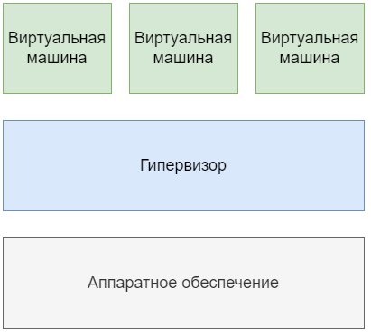
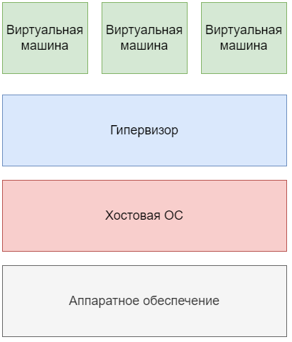
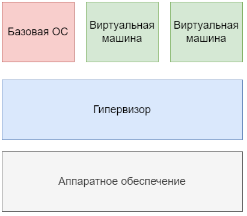

# Виртуализация

## Определение

Виртуализация - предоставление набора вычислительных ресурсов или их логического объединения, абстрагированное от аппаратной реализации, и обеспечивающее при этом логическую изоляцию друг от друга вычислительных процессов, выполняемых на одном физическом ресурсе.

Основные виды виртуализации:

+ **Аппаратная виртуализация** - позволяет создавать независимые и изолированные друг от друга виртуальные компьютеры с помощью программной имитации ресурсов (процессора, памяти, сети, диска и др.) физического сервера. Физический сервер называют хостовой машиной (хостом), виртуальные компьютеры – виртуальными машинами, ВМ (иногда их также называют гостями). Программное обеспечение, которое создает виртуальные машины и управляет ими, называют гипервизором. На практике на виртуальных машинах могут использоваться разные ОС для разных целей – например, Windows Server под контроллер домена Active Directory и Debian под веб-сервер NGINX.
+ **Виртуализация рабочих столов** - позволяет отделить логический рабочий стол (набор пользовательских программ, работающий под ОС) от физической инфраструктуры (например, персональных компьютеров). Одной из наиболее распространенных форм виртуализации рабочих столов является VDI (Virtual Desktop Infrastructure) – инфраструктура виртуальных рабочих столов. Каждый пользователь VDI имеет программную имитацию ОС с необходимым набором программ на физическом сервере под управлением гипервизора и может подключаться к ней по сети. На практике VDI может использоваться для работы большого количества сотрудников на «удаленке» для того, чтобы не закупать им отдельные рабочии станции и управлять инфраструктурой централизованно.
+ **Виртуализация на уровне ОС (контейнеризация)** - позволяет запускать программное обеспечение в изолированных на уровне операционной системы пространствах. Наиболее распространенной формой виртуализации на уровне ОС являются контейнеры (например, Docker). Контейнеры более легковесны, чем виртуальные машины, так как они опираются на функционал ядра ОС и им не требуется взаимодействовать с аппаратным обеспечением. На практике контейнеры представляют из себя изолированную среду для запуска любого приложения со всеми его зависимостями и настройками.

## Виртуализация серверов

Виртуализация серверов - это процесс разделения физического сервера на несколько уникальных и изолированных виртуальных машин (серверов) с помощью программного обеспечения (гипервизора). На каждом виртуальном сервере могут независимо выполняться собственные операционные системы.

Виртуализация серверов позволяет:

+ Оптимизировать затраты на покупку серверного оборудования. Под каждую задачу выделяется виртуальный сервер с необходимым количеством ресурсов (ЦПУ, ОЗУ и др.), простои оборудования минимизируются.
+ Упростить сопровождение инфраструктуры. Создание, удаление или обслуживание виртуальной машины как правило проще и быстрее, чем аналогичные операции с физическим сервером.
+ Повысить отказоустойчивость инфраструктуры. Виртуальные машины изолированы друг от друга, программный сбой на одной них не приведет к потере работоспособности сервисов и приложений на остальных.
  
Гипервизор обеспечивает изолированную среду выполнения для каждой виртуальной машины, а также управляет доступом ВМ и гостевых ОС к аппаратным ресурсам физического сервера. Говоря простыми словами, гипервизор обеспечивает параллельное и независимое функционирование нескольких операционных систем на одном компьютере. В классическом подходе гипервизоры группируются по двум типам: гипервизоры первого типа запускаются непосредственно на аппаратном обеспечении компьютера, а гипервизорам второго типа для работы необходимо наличие хостовой операционной системы. В последние несколько лет классическая классификация претерпевает изменения – добавился гибридный тип гипервизоров, который сочетает характеристики первого и второго типов.

## Гипервизоры

### Гипервизоры первого типа (native, bare-metal)

Гипервизор первого типа выполняется как контрольная программа непосредственно на аппаратной части компьютера и не требует ОС общего назначения. В данной архитектуре гипервизор управляет распределением вычислительных ресурсов и сам контролирует все обращения виртуальных машин к устройствам.

Гипервизоры первого типа показывают высокое быстродействие, однако обладают очевидным недостатком – необходимость поддерживать драйверы устройств приводит к сужению списка совместимого аппаратного обеспечения.

Примеры:

+ VMWare ESXi
+ KVM (Proxmox VE) – может быть также отнесен ко второму типу
+ Xen (Xenserver, Citrix Hypervisor), Hyper-V – могут быть также отнесены к гибридному типу

### Гипервизоры второго типа (hosted)

Гипервизор второго типа выполняется поверх хостовой операционной системы (как правило Linux). Он управляет гостевыми операционными системами, в то время как эмуляцией и управлением физическими ресурсами занимается хостовая ОС.

Гипервизоры второго типа показывают меньшее относительно гипервизоров первого типа быстродействие и реже используются в промышленной эксплуатации, однако отлично подходят для задач обучения и разработки ПО.

Примеры:
+ Oracle VM VirtualBox, VMWare Workstation
+ KVM (Proxmox VE) – может быть также отнесен к первому типу

### Гипервизоры гибридного типа (hybrid)

Гибридный гипервизор сочетает в себе характеристики гипервизоров первого и второго типов – он выполняется поверх специализированной сервисной (или базовой) операционной системы. Сервисная ОС называется родительским разделом или доменом (parent partition в терминологии Hyper-V или domain dom0 в терминологии Xen). После установки гипервизора ядро ОС переходит в режим поддержки виртуализации и передает управление ресурсами процессора и памяти гипервизору. При этом родительский раздел берет на себя функцию обработки обращений к драйверам устройств и операциям ввода-вывода.

Данный подход удобен с точки зрения совместимости с оборудованием: не требуется добавлять в гипервизор драйверы устройств (расширяется список совместимого аппаратного обеспечения). Также гипервизор освобождается от задачи обработки вызовов к драйверам устройств – эти вызовы обрабатывает сервисная ОС.

Примеры:
+ Xen (XenServer, Citrix Hypervisor)
+ Hyper-V

## Облачные вычисления и виртуальные машины

Виртуализацию легко перепутать с облаком главным образом потому, что оба они связаны с созданием функциональной среды из ресурсов в сети. Однако виртуализация — это технология, позволяющая запускать несколько виртуальных машин на одном физическом устройстве. Оборудование запускает ваше программное обеспечение, позволяя устанавливать несколько операционных систем, которые могут работать одновременно и независимо в безопасной среде с минимальным снижением производительности.

Облака же — это ИТ-среды, которые абстрагируют, объединяют и совместно используют масштабируемые ресурсы в сети.

Виртуализация — это технология, а облачные вычисления — это среда. Виртуализация — это основное программное обеспечение для облачных вычислений, которые стали настолько важным инструментом, что компании, которые их не используют, ставят себя в невыгодное положение в конкурентной борьбе.