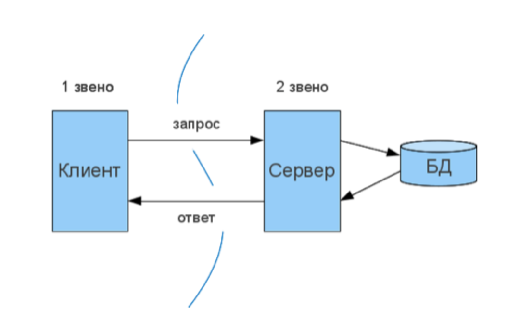
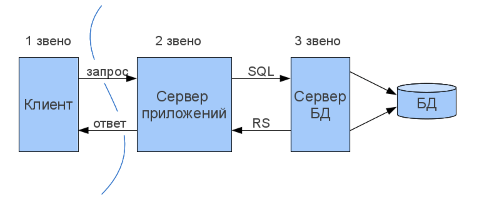
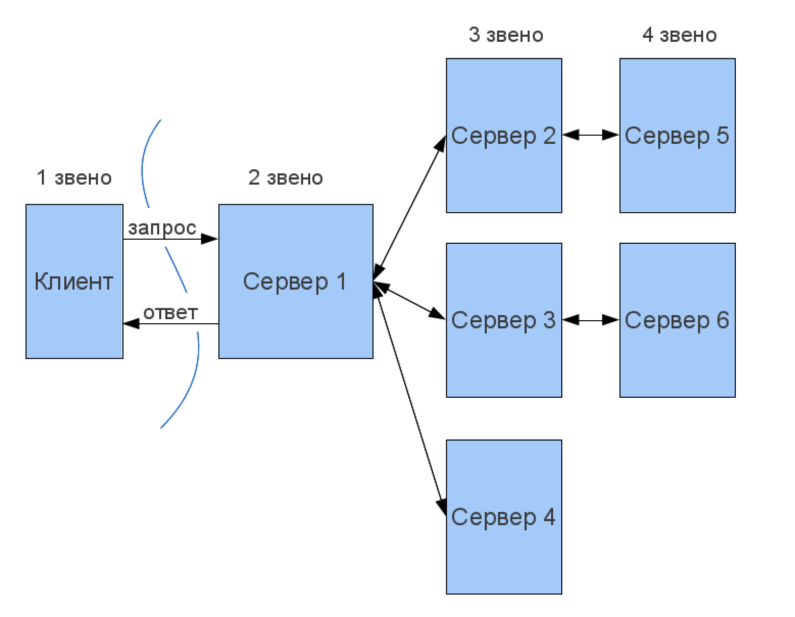

# Тестирование web-приложений

## Web-приложение

Web-приложение - это клиент-серверное приложение, в котором клиентом выступает браузер, а сервером – веб-сервер.

Основная часть приложения, как правило, находится на стороне веб-сервера, который обрабатывает полученные запросы в соответствии с бизнес-логикой продукта и формирует ответ, отправляемый пользователю. На этом этапе в работу включается браузер, именно он преобразовывает полученный ответ от сервера в графический интерфейс, понятный пользователю.

Архитектура "клиент-сервер" определяет общие принципы организации взаимодействия в сети, где имеются серверы, узлы-поставщики некоторых специфичных функций (сервисов) и клиенты (потребители этих функций).

Практические реализации такой архитектуры называются клиент-серверными технологиями.

### Компоненты web-приложения

**Клиент** – это браузер, но встречаются и исключения (в тех случаях, когда один веб-сервер (ВС1) выполняет запрос к другому (ВС2), роль клиента играет веб-сервер ВС1). В классической ситуации (когда роль клиента выполняет браузер) для того, чтобы пользователь увидел графический интерфейс приложения в окне браузера, последний должен обработать полученный ответ веб-сервера, в котором будет содержаться информация, реализованная с применением HTML, CSS, JS (самые используемые технологии). Именно эти технологии «дают понять» браузеру, как именно необходимо «отрисовать» все, что он получил в ответе.

**Веб-сервер** – это сервер, принимающий HTTP-запросы от клиентов и выдающий им HTTP-ответы. Веб-сервером называют как программное обеспечение, выполняющее функции веб-сервера, так и непосредственно компьютер, на котором это программное обеспечение работает. Наиболее распространенными видами ПО веб-серверов являются Apache, IIS и NGINX. На веб-сервере функционирует тестируемое приложение, которое может быть реализовано с применением самых разнообразных языков программирования: PHP, Python, Ruby, Java, Perl и пр.

**База данных** - это информационная модель, позволяющая упорядоченно хранить данные об объекте или группе объектов, обладающих набором свойств, которые можно категоризировать. Базы данных функционируют под управлением так называемых систем управления базами данных (далее – СУБД). Самыми популярными СУБД являются MySQL, MS SQL Server, PostgreSQL, Oracle (все – клиент-серверные).

База данных фактически не является частью веб-сервера, но большинство приложений просто не могут выполнять все возложенные на них функции без нее, так как именно в базе данных хранится вся динамическая информация приложения (учетные, пользовательские данные и пр).

### Двухзвенная архитектура

Двухзвенная архитектура - распределение трех базовых компонентов между двумя узлами (клиентом и сервером). Двухзвенная архитектура используется в клиент-серверных системах, где сервер отвечает на клиентские запросы напрямую и в полном объеме.

### Трехзвенная архитектура

Трехзвенная архитектура - сетевое приложение разделено на две и более частей, каждая из которых может выполняться на отдельном компьютере. Выделенные части приложения взаимодействуют друг с другом, обмениваясь сообщениями в заранее согласованном формате.

Третьим звеном в трехзвенной архитектуре становится сервер приложений.

Трехзвенная архитектура может быть расширена до многозвенной (N-tier, Multi-tier) путем выделения дополнительных серверов, каждый из которых будет представлять собственные сервисы и пользоваться услугами прочих серверов разного уровня.

Двухзвенная архитектура проще, так как все запросы обслуживаются одним сервером, но именно из-за этого она менее надежна и предъявляет повышенные требования к производительности сервера.

Трехзвенная архитектура сложнее, но, благодаря тому, что функции распределены между серверами второго и третьего уровня, эта архитектура предоставляет:

+ Высокую степень гибкости и масштабируемости
+ Высокую безопасность (т.к. защиту можно определить для каждого сервиса или уровня)
+ Высокую производительность (т.к. задачи распределены между серверами)

## Клиент-серверные технологии

Архитектура клиент-сервер применяется в большом числе сетевых технологий, используемых для доступа к различным сетевым сервисам.

Типы сервисов:

+ **Web-серверы**. Изначально предоставляли доступ к гипертекстовым документам по протоколу HTTP (Hyper Text Transfer Protocol). Сейчас поддерживают расширенные возможности, в частности, работу с бинарными файлами (изображения, мультимедиа и т.п.).

+ **Серверы приложений**. Предназначены для централизованного решения прикладных задач в некоторой предметной области. Для этого пользователи имеют право запускать серверные программы на исполнение. Использование серверов приложений позволяет снизить требования к конфигурации клиентов и упрощает общее управление сетью.

+ **Серверы баз данных**. Серверы баз данных используются для обработки пользовательских запросов на языке SQL. При этом, СУБД находится на сервере, к которому и подключаются клиентские приложения.

+ **Файл-серверы**. Файл-сервер хранит информацию в виде файлов и предоставляет пользователям доступ к ней. Как правило, файл-сервер обеспечивает и определенный уровень защиты от несанкционированного доступа

+ **Прокси-сервер**. Во-первых, действует как посредник, помогая пользователям получить информацию из Интернета и, при этом, обеспечивая защиту сети. Во-вторых, сохраняет часто запрашиваемую информацию в кэш-памяти на локальном диске, быстро доставляя ее пользователям, без повторного обращения к Интернету.

+ **Файрволы (брандмауэры)**. Межсетевые экраны, анализирующие и фильтрующие проходящий сетевой трафик, с целью обеспечения безопасности сети.

+ **Почтовые серверы**. Предоставляют услуги по отправке и получению электронных почтовых сообщений.

+ **Серверы удаленного доступа (RAS)**. Эти системы обеспечивают связь с сетью по коммутируемым линиям. Удаленный сотрудник может использовать ресурсы корпоративной ЛВС, подключившись к ней с помощью обычного модема.

## Типы клиентов

Для доступа к тем или иным сетевым сервисам используются клиенты, возможности которых характеризуются понятием толщины. Оно определяет конфигурацию оборудования и программное обеспечение, имеющиеся у клиента. Рассмотрим возможные граничные значения:

### Тонкий клиент

Этот термин определяет клиента, вычислительных ресурсов которого достаточно лишь для запуска необходимого сетевого приложения через web-интерфейс. Пользовательский интерфейс такого приложения формируется средствами статического HTML (выполнение JavaScript не предусматривается), вся прикладная логика выполняется на сервере. Для работы тонкого клиента достаточно лишь обеспечить возможность запуска web-браузера, в окне которого и осуществляются все действия. По этой причине web-браузер часто называют "универсальным клиентом".

### Толстый клиент

Таковым является рабочая станция или персональный компьютер, работающие под управлением собственной дисковой операционной системы и имеющие необходимый набор программного обеспечения. К сетевым серверам толстые клиенты обращаются, в основном, за дополнительными услугами (например, доступ к web-серверу или корпоративной базе данных).

Так же под толстым клиентом подразумевается и клиентское сетевое приложение, запущенное под управлением локальной ОС. Такое приложение совмещает компонент представления данных (графический пользовательский интерфейс ОС) и прикладной компонент (вычислительные мощности клиентского компьютера).

**Протокол передачи данных** — набор соглашений интерфейса логического уровня, которые определяют обмен данными между различными программами. Эти соглашения задают единообразный способ передачи сообщений и обработки ошибок при взаимодействии ПО.

**Сетевой протокол** — набор правил и действий (очерёдности действий), позволяющий осуществлять соединение и обмен данными между двумя и более включёнными в сеть устройствами.

## Сетевые протоколы

**TCP/IP** — набор протоколов передачи данных, получивший название от двух принадлежащих ему протоколов: TCP (англ. Transmission Control Protocol) и IP (англ. Internet Protocol).

Наиболее известные протоколы, используемые в сети Интернет:

+ **HTTP (Hyper Text Transfer Protocol)** — это протокол передачи гипертекста.

+ **HTTPS (HyperText Transfer Protocol Secure)** - расширение протокола HTTP для поддержки шифрования, в целях повышения безопасности. Данные в протоколе HTTPS передаются поверх криптографических протоколов SSL или TLS.

+ **SSL ( Secure Sockets Layer — уровень защищённых cокетов)** — криптографический протокол, который подразумевает более безопасную связь.

+ **FTP (File Transfer Protocol)** — это протокол передачи файлов со специального файлового сервера на компьютер пользователя.

+ **POP3 (Post Office Protocol)** — это стандартный протокол почтового соединения.

+ **SMTP (Simple Mail Transfer Protocol)** — протокол, который задает набор правил для передачи почты.

+ **TELNET** — это протокол удаленного доступа.

+ **DTN** — протокол, предназначенный для сетей дальней космической связи IPN, которые используются NASA.

## Тестирование web-приложений

Тестирование веб приложений включает:

+ Функциональное тестирование
+ Тестирование безопасности
+ Нагрузочное тестирование
+ Кроссбраузерное тестирование

### Функциональное тестирование

Функциональное тестирование рассматривает заранее указанное поведение и основывается на анализе спецификаций функциональности компонента или системы в целом.

Функциональные тесты основываются на функциях, выполняемых системой, и могут проводиться на всех уровнях тестирования(компонентном, интеграционном, системном, приемочном). Как правило, эти функции описываются в требованиях, функциональных спецификациях или в виде случаев использования системы (use cases).

Тестирование функциональности может проводиться в двух аспектах:

+ Требования
+ Бизнес-процессы

Тестирование в перспективе «требования» использует спецификацию функциональных требований к системе, как основу для дизайна тестовых случаев (Test Cases). В этом случае необходимо сделать список того, что будет тестироваться, а что нет, приоритезировать требования на основе рисков, а на основе этого приоритезировать тестовые сценарии (test cases). Это позволит сфокусироваться и не упустить при тестировании наиболее важный функционал.

Тестирование в перспективе «бизнес-процессы» использует знание этих самых бизнес-процессов, которые описывают сценарии ежедневного использования системы. В этой перспективе, тестовые сценарии (test scripts), как правило, основываются на случаях использования системы (use cases).

Преимущества функционального тестирования:

+ Имитирует фактическое использование системы

Недостатки функционального тестирования:

+ Возможность упущения логических ошибок в программном обеспечении
+ Вероятность избыточного тестирования

### Тестирование безопасности

Тестирование безопасности - это стратегия тестирования, используемая для проверки безопасности системы, а также для анализа рисков, связанных с обеспечением целостного подхода к защите приложения, атак хакеров, вирусов, несанкционированного доступа к конфиденциальным данным.

Принципы безопасности программного обеспечения:

+ Конфиденциальность - ограничение доступа к ресурсу некоторой категории пользователей или, другими словами, при каких условиях пользователь авторизован получить доступ к данному ресурсу.
+ Целостность и доверие - ожидается, что ресурс будет изменен только соответствующим способом определенной группой пользователей.
+ Повреждение и восстановление - в случае, когда данные повреждаются или неправильно меняются авторизованным или не авторизованным пользователем, Вы должны определить, насколько важной является процедура восстановления данных.
+ Доступность - требования о том, что ресурсы должны быть доступны авторизованному пользователю, внутреннему объекту или устройству. Как правило, чем более критичен ресурс, тем выше уровень доступности должен быть.

#### Виды уязвимостей

Наиболее распространенными видами уязвимости в безопасности программного обеспечения являются:

+ XSS (Cross-Site Scripting) - это вид уязвимости программного обеспечения (Web приложений), при которой на генерированной сервером странице выполняются вредоносные скрипты с целью атаки клиента.
+ XSRF / CSRF (Request Forgery) - это вид уязвимости, позволяющий использовать недостатки HTTP протокола, при этом, злоумышленники работают по следующей схеме: ссылка на вредоносный сайт устанавливается на странице, пользующейся доверием у пользователя, при переходе по вредоносной ссылке выполняется скрипт, сохраняющий личные данные пользователя (пароли, платежные данные и т.д.), либо отправляющий СПАМ сообщения от лица пользователя, либо изменяет доступ к учетной записи пользователя для получения полного контроля над ней.
+ Code injections (SQL, PHP, ASP) - это вид уязвимости, при котором становится возможно осуществить запуск исполняемого кода с целью получения доступа к системным ресурсам, несанкционированного доступа к данным либо выведения системы из строя. 
+ Server-Side Includes (SSI) Injection - это вид уязвимости, использующий вставку серверных команд в HTML код или запуск их напрямую с сервера.
+ Authorization Bypass - это вид уязвимости, при котором возможно получить несанкционированный доступ к учетной записи или документам другого пользователя. Допустим, есть реализация, где, при просмотре своего профиля, содержащего конфеденциальную информацию, в URL страницы передается userID, в данном случае, есть смысл попробовать подставить вместо своего userID номер другого пользователя. И если Вы увидите его данные, значит Вы нашли дефект.

### Нагрузочное тестирование

Нагрузочное тестирование или тестирование производительности - это автоматизированное тестирование, имитирующее работу определенного количества бизнес пользователей на каком-либо общем (разделяемом ими) ресурсе.

#### Тестирование производительности (Performance testing)

Задачей тестирования производительности является определение масштабируемости приложения под нагрузкой, при этом происходит:

+ Измерение времени выполнения выбранных операций при определенных интенсивностях выполнения этих операций
+ Определение количества пользователей одновременно работающих с приложением
+ Определение границ приемлемой производительности при увеличении нагрузки (при увеличении интенсивности выполнения этих операций).
Исследование производительности на высоких, предельных, стрессовых нагрузках

#### Стрессовое тестирование (Stress Testing)

Стрессовое тестирование позволяет проверить, насколько приложение и система в целом работоспособны в условиях стресса и также оценить способность системы к регенерации, т.е. к возвращению к нормальному состоянию после прекращения воздействия стресса. Стрессом, в данном контексте, может быть повышение интенсивности выполнения операций до очень высоких значений или аварийное изменение конфигурации сервера. 

Также одной из задач при стрессовом тестировании может быть оценка деградации производительности, таким образом, цели стрессового тестирования могут пересекаться с целями тестирования производительности.

#### Объемное тестирование (Volume Testing)

Задачей объемного тестирования является получение оценки производительности при увеличении объемов данных в базе данных приложения, при этом происходит:

+ Измерение времени выполнения выбранных операций при определенных интенсивностях выполнения этих операций
+ Может производиться определение количества пользователей одновременно работающих с приложением

#### Тестирование стабильности или надежности (Stability / Reliability Testing)

Задачей тестирования стабильности (надежности) является проверка работоспособности приложения при длительном (многочасовом) тестировании со средним уровнем нагрузки. Время выполнения операций может играть в данном виде тестирования второстепенную роль. При этом, на первое место выходит отсутствие утечек памяти, перезапусков серверов под нагрузкой и другие аспекты влияющие именно на стабильность работы.

### Кроссбраузерное тестирование

Кросс-браузерное тестирование представляет собой процесс тестирования веб-приложений в нескольких браузерах.

В настоящее время пользователи имеют широкий выбор браузеров для доступа к веб-приложениям, поэтому в современных условиях стало крайне важным выполнять кросс-браузерное тестирование. В разных браузерах компоненты приложений могут вести себя по-разному.

Такое поведение приложения может быть вызвано рядом факторов:

+ Разработанное веб-приложение может быть не адаптивно под тот или иной браузер или его версию
+ Неверно были применены стандарты, по которым разрабатывается сам браузер
+ Были допущены ошибки при разработке браузера
+ У пользователя установлен какой-либо плагин или надстройка, вызывающие ошибки веб-приложения

Из-за разной работы браузеров или ошибок, допущенных в нем, могут возникать дефекты в Вашем продукте. Часто встречающиеся дефекты:

**Верстка**. Наиболее распространенная ошибка в различных браузерах. Разработчики часто создают приложение и проверяют его в одном, наиболее удобном дня них, браузере. Но у пользователей может быть установлена другая версия браузера, в котором «красивая картинка» разработчика может выглядеть совсем некрасиво у пользователя. Такие ошибки чаще всего не являются критичными, но неприятное впечатление о вашем продукте могут оставить.

**Навигация**. Бывают ситуации, когда в одном из браузеров ссылка не работает, как было запланировано, либо не работает вовсе. Такие ошибки могут негативно отразиться на Вашем продукте. Когда клиент не находит нужный раздел или не может перейти на другую страницу, чтобы завершить действие, это доставляет неудобства и раздражает. Как результат – потеря клиента.

**Ошибки JavaScript**. Такие ошибки имеют высокий приоритет. Неработоспособность JavaScript в одном из браузеров может привести к потере заказа, клиента, или к потере документа, например, если у вас система электронного документооборота; к невозможности создания заявки, если у вас система заявок и т.д.
