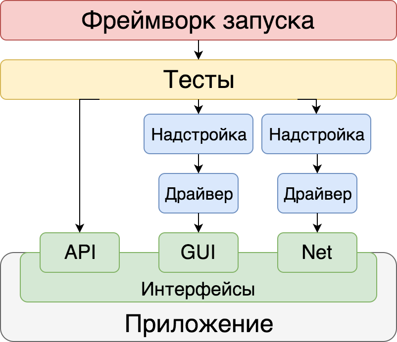
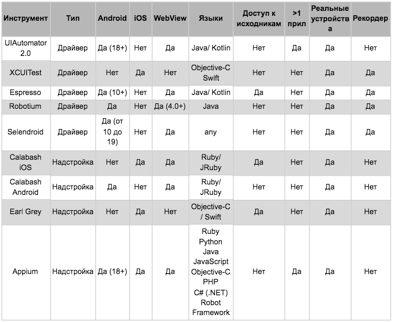
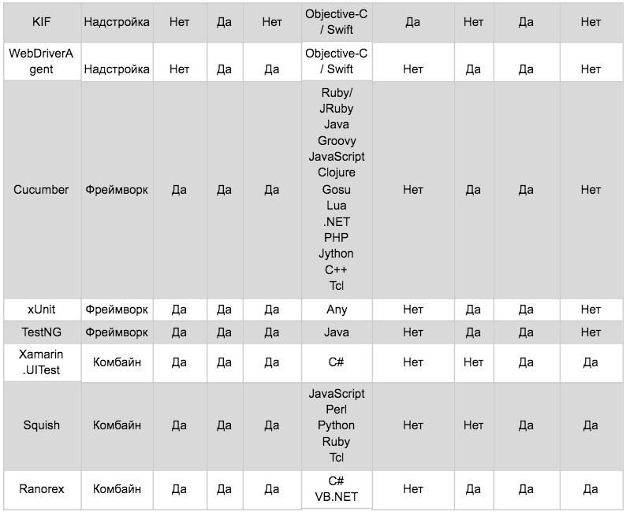

# Инструменты для тестирования мобильных приложений

## Эмуляторы и симуляторы

*Симуляторы* виртуально воспроизводят поведение системы и её интерфейса. Симуляции имитируют выполнение кода. 

*Эмуляторы* воссоздают все основные компоненты устройства, в том числе процессор, память и устройства ввода/вывода.

В большинстве случаев, для запуска симулятора, используются `XCode` и для эмулятора `Android Studio`.

### Недостатки симуляторов и эмуляторов

Главный недостаток как симуляторов, так и эмуляторов в том, что они не могут полностью заменить физический девайс. С их помощью мы можем проверить верстку или работоспособность приложения в целом, но мы не можем проверить корректную работу приложения при взаимодействии с остальными системами телефона, то есть как будет функционировать приложение при:

+ Медленном интернете
+ Получении звонка или СМС
+ Использовании камеры, микрофона или геолокации

Работа приложения на симуляторе и эмуляторе может отличаться от работы на реальном девайсе ещё и по следующим причинам:

+ При тестировании не учитывается аппаратная часть приложения
+ Многое зависит от мощности компьютера, на котором выполняется тестирование.

Поэтому очень важно соблюдать баланс между физическими устройствами, симуляторами и эмуляторами.

### Тестовые фермы

Тестовая ферма — это инструмент, который позволяет подключиться к реальному девайсу и выполнить полноценное тестирование. Экран устройства транслируется онлайн.

`Firebase Test Lab` — ферма от Google. Позволяет тестировать приложение на различных реальных устройствах и конфигурациях IOS и Android. Все устройства расположены в центре обработки данных Google. Test Lab интегрирована с консолью Firebase, Android Studio и с интерфейсом командной строки gcloud. 

Бесплатно можно запустить 5 тестов в день на реальных устройствах и 10 тестов — на виртуальных. За большее придется платить 1$ за час на эмуляторе и 5$ за час на реальном устройстве.

`AWS Device Farm` — вариант от Amazon, ферма для тестирования на виртуальных и реальных устройствах. Первые 1000 минут бесплатно. Доступ более чем к 500 тестовым устройствам. Есть возможность написания скриптов с использованием Appium, Espresso, Robotium, UI Automation, XCTest и другие.

`BrowserStack` — позволяет выполнять тестирование как в ручном режиме так и используя Selenium или Appium. Есть ограничение на количество одновременных сессий. Если оплатить 199$, можно тестировать неограниченное время. В наличии большой выбор тестовых устройств. Есть возможность просмотра логов, плагины для TeamCity, Jenkins, Travis CI.

`SauceLabs` — облачная платформа для автоматизированного тестирования веб-приложений и мобильных приложений. Тариф для ручного кроссбраузерного и мобильного тестирования — 39$ в месяц с неограниченным количеством пользователей и временем на тестирование., Есть бесплатная пробная версия на 28 дней с доступным временем для тестирования 160 минут.

## Сервисы TestFlight и Beta

Активная работа по выявлению ошибок, влияющих на корректную работу приложения, производится на этапе бета-тестирования — использования практически готовой версии перед окончательным запуском. Для бета-тестирования мобильных приложений используют сервисы TestFlight для iOS и Beta для Android.

## Классификация инструментов

Драйвер — программа, которая предоставляет API для одного из интерфейсов приложения.

Надстройка — программа, которая взаимодействует с приложением через один или несколько драйверов, повышая удобство их использования или расширяя их возможности.

Фреймворк — это программа для формирования, запуска и сбора результатов запуска набора тестов.

### Драйверы

В мобильном тестировании драйверов немного, и зачастую они разрабатываются теми же компаниями, что и операционные системы. Для Android есть два официальных драйвера: UIAutomator, который на сегодняшний день имеет версию 2.0, и Espresso. Оба они входят в Android Testing Support Library, разрабатываются компанией Google и хорошо документированы. Помимо них, существуют проекты Robotium и Selendroid, которые разрабатываются сторонними компаниями. Все четыре продукта так или иначе работают на Android Instrumentation Framework — базовом API, который Android предоставляет для взаимодействия с системой.

В iOS для взаимодействия с приложением долгое время использовался драйвер UIAutomation (что, помимо прочего, вызывало путаницу из-за схожести с названием драйвера Android), но начиная с iOS 10 Apple прекратила поддержку этого драйвера, и вместо него появился драйвер XCUITest из пакета XCTest.

### Надстройки

Appium — наиболее известная сегодня надстройка. Она позволяет тестировать приложения практически вне зависимости от платформы, типа и версии системы. Конечно, такой подход имеет несколько значительных достоинств и недостатков.

Appium поддерживает множество драйверов, не только мобильные:

+ iOS
    + XCUITest
    + (deprecated) UIAutomation
+ Android
    + (beta) Espresso
    + UIAutomator 2.0
    + (deprecated) UIAutomator
    + (deprecated) Selendroid
+ Windows Driver (для десктопных Windows-приложений)
+ Mac Driver (для десктопных Mac-приложений)

Поддержка такого разнообразия драйверов реализуется довольно интересным образом: Appium использует версию интерфейса WebDriver, известную всем по Selenium WebDriver. И, помимо большого количества поддерживаемых платформ, у такого подхода есть и другие преимущества:

+ Возможность писать тесты на любом языке, который поддерживает WebDriver (а в этот список входят практически все популярные языки программирования)
+ Легкий переход к тестированию гибридных и веб-приложений: протокол WebDriver уже (почти) стал стандартом для автоматизации веба
+ Использование любого тестового фреймворка — почти все они умеют так или иначе работать с протоколом WebDriver, а значит, у них не возникнет проблем с подключением к Appium
+ Отсутствие необходимости добавлять что-то в код приложения — для каждой платформы используются драйверы, которым не нужен доступ к коду. Помимо удобства в развёртывании, это означает возможность тестировать именно тот билд приложения, который увидят пользователи, а не специальную тестовую сборку

Недостатки Appium вытекают из его достоинств:

+ Тесты ломаются чаще, чем те, что написаны для нативных драйверов, из-за ошибок в коде самой надстройки. Особенно это актуально для iOS
+ Appium не умеет находить и сравнивать картинки в приложениях и не может напрямую работать с алёртами в Android
+ Ограниченная поддержка Android API < 17, но это, возможно, будет исправлено подключением Espresso в качестве драйвера

Тем не менее надстройка Appium очень популярна и активно развивается, поэтому многие проблемы могут решиться сообществом в будущем.
